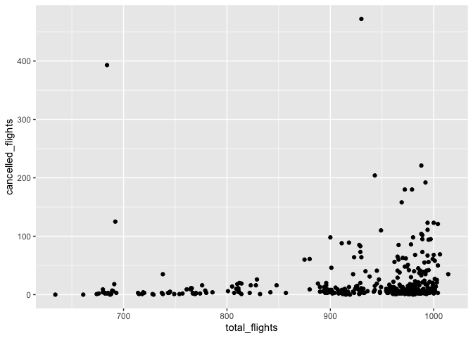
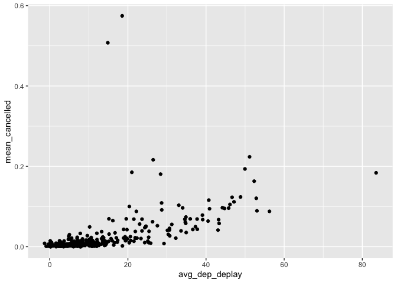

STAT 433 HW 1
================
2022-09-20

Package Loading:

``` r
library(dplyr)
library(nycflights13)
library(ggplot2)
library(tidyverse)
```

### Question 1

**How many flights have a missing dep_time? **

``` r
misfl = flights %>%
  filter(is.na(dep_time))

nrow(misfl)
```

    ## [1] 8255

**What other variables are missing?**

``` r
misfl %>%
  select(dep_time, dep_delay, arr_time, air_time)
```

    ## # A tibble: 8,255 × 4
    ##    dep_time dep_delay arr_time air_time
    ##       <int>     <dbl>    <int>    <dbl>
    ##  1       NA        NA       NA       NA
    ##  2       NA        NA       NA       NA
    ##  3       NA        NA       NA       NA
    ##  4       NA        NA       NA       NA
    ##  5       NA        NA       NA       NA
    ##  6       NA        NA       NA       NA
    ##  7       NA        NA       NA       NA
    ##  8       NA        NA       NA       NA
    ##  9       NA        NA       NA       NA
    ## 10       NA        NA       NA       NA
    ## # … with 8,245 more rows

The missing columns are departure delay, arrival time and arrival delay.

**What might these rows represent?**

These values could represent that the flights were cancelled.

### Question 2

**Currently dep_time and sched_dep_time are convenient to look at, but
hard to compute with because they’re not really continuous numbers.
Convert them to a more convenient representation of number of minutes
since midnight.**

``` r
flights %>%
  mutate(sched_dep_time_mins = (hour*60) + (minute)) %>%
  mutate(dep_time_mins = sched_dep_time_mins + dep_delay) %>%
  select(sched_dep_time_mins, dep_time_mins)
```

    ## # A tibble: 336,776 × 2
    ##    sched_dep_time_mins dep_time_mins
    ##                  <dbl>         <dbl>
    ##  1                 315           317
    ##  2                 329           333
    ##  3                 340           342
    ##  4                 345           344
    ##  5                 360           354
    ##  6                 358           354
    ##  7                 360           355
    ##  8                 360           357
    ##  9                 360           357
    ## 10                 360           358
    ## # … with 336,766 more rows

### Question 3

**Look at the number of canceled flights per day. Is there a pattern?
Use multiple dyplr operations, all on one line, concluding with
ggplot(aes(x= ,y=)) + geom_point()**

``` r
flights %>%
  mutate(cancelled = (is.na(arr_delay) & is.na(dep_delay))) %>%
  group_by(year, month, day) %>%
  summarise(cancelled_flights = sum(cancelled), total_flights = n()) %>%
  ggplot() +
  geom_point(aes(y = cancelled_flights, x = total_flights))
```

<!-- --> From the
plot, it suggests that as the total number of flights increase, the
amound of delayed flights likewise increase.

**Is the proportion of canceled flights related to the average delay? **

``` r
flights %>%
  mutate(cancelled = (is.na(arr_delay) & is.na(dep_delay))) %>%
  group_by(year, month, day) %>%
  summarise(mean_cancelled = mean(cancelled),
            avg_dep_deplay = mean(dep_delay, na.rm = T)) %>%
  ggplot()+
  geom_point(aes(avg_dep_deplay, mean_cancelled))
```

<!-- --> From the
plot, it seems like with longer departure delays, the number of
cancelled flights on average increases.
